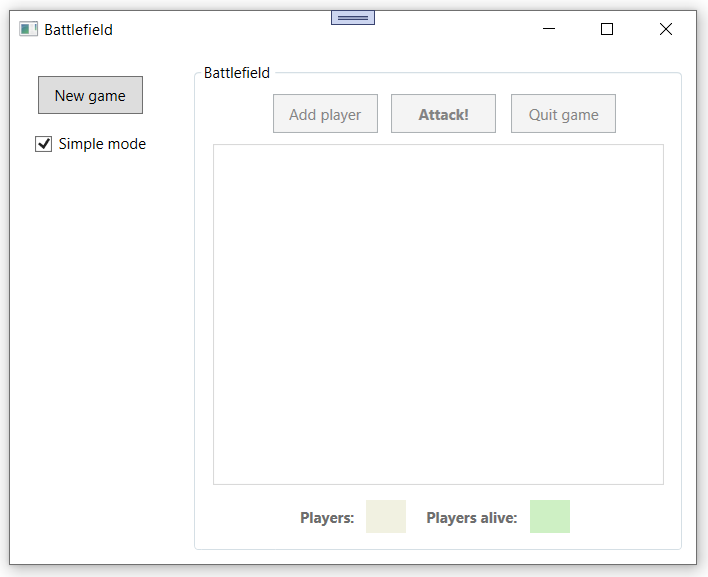
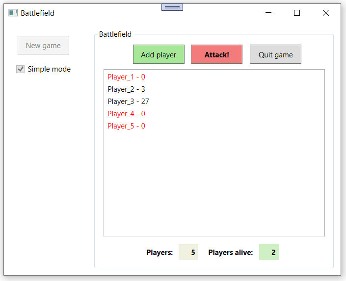
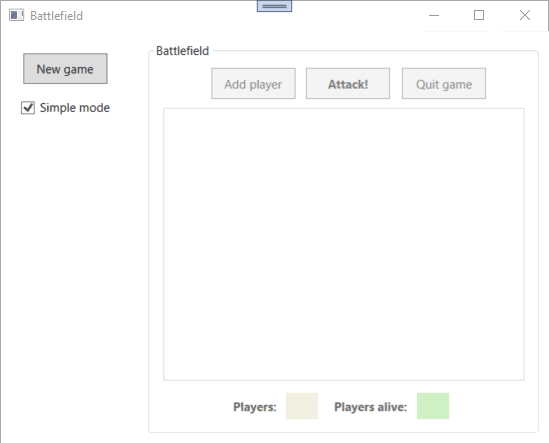
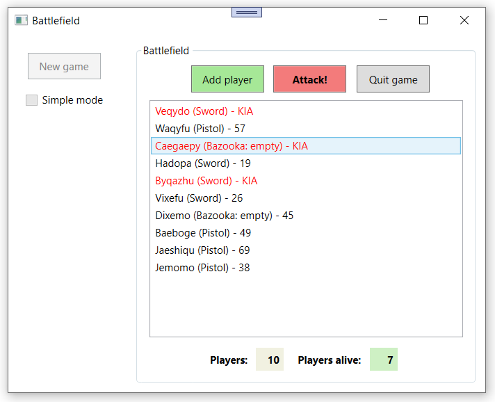
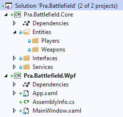

# PE2: Battlefield

Voor deze opdracht gaan we nog eens oorlogje spelen.
Deze keer met toepassing van **geavanceerde klassen** en **interfaces**, om onderscheid te maken tussen:
- Soorten spelers
- Soorten wapens
- Type spel

**Om jullie te helpen, geven we de volledige klassenstructuur cadeau.**
**Deze wordt hieronder uitgebreid beschreven in de toelichting van de class library.**
**Van de interfaces krijg je tevens reeds de implementatie cadeau.**
**De klassen moet je wel nog zelf implementeren volgens de instructies hieronder.**

## GUI Reeds aanwezig

Zoals gewoonlijk krijg je van ons de WPF GUI reeds cadeau, maar moet je wel zelf nog de code behind schrijven.
Wanneer je de applicatie opstart, krijg je het volgende te zien:



Er is maar een knop actief: deze om een nieuw spel te starten.
Daarnaast kan je kiezen om al dan niet in "Simple mode" te spelen—deze optie staat standaard aangevinkt.
Wanneer je een nieuw spel start, worden de knop "New game" en bijhorende checkbox inactief en wordt het
rechterpaneel actief, waarin het spel gespeeld zal worden (zie verder voor de twee spelmodi).

Tijdens een actief spel zie je onderaan het scherm steeds het total aantal spelers en het totale aantal levende spelers.
Er zijn drie knoppen in het spel:
1. **Add player:** hiermee wordt een (automatisch gegenereerde) speler toegevoegd aan het spel. Je moet minstens twee spelers toevoegen om oorlogje te kunnen spelen.
2. **Attack!:** met deze knop voer je een aanvalsronde uit. De spelers vallen elkaar aan volgens de spelregels, afhankelijk van de gekozen spelmode (zie verder).
3. **Quit game:** met deze knop verlaat je het spel en kom je terug in de startsituatie terecht. Alle informatie van het gespeelde spel wordt gewist.

Zoals je kan zien in de screenshots en animaties, worden dode spelers in het rood getoond in de listbox.
De setup hiervoor werd reeds voorzien en is gebaseerd op de property `IsAlive` van een speler met interface `IPlayer` (zie verder).

## Simple mode

De eenvoudige modus ziet er na een paar aanvalsrondjes bv. als volgt uit:



**Belangrijke aandachtspunten:**
- Spelers krijgen hier simpelweg een naam **Player_x** waarbij x oploopt vanaf 1 tot het aantal toegevoegde spelers.
- Een speler start altijd met een hoevelheid **health** (leven) van 100. Deze wordt getoond na de naam.
- Tijdens de **aanvalsrondes** vallen de spelers elkaar als volgt aan:
  - Elke **levende** speler valt de **volgende nog levende speler** uit de lijst aan. De **laatste** levende speler in de lijst valt de **eerste** levende speler aan. **Let op:** een speler valt **nooit** zichzelf aan, m.a.w. wanneer er nog maar 1 levende speler over is, gebeurt er helemaal niks meer.
  - Hierbij wordt telkens een **random** hoeveelheid **leven** tussen **0 en 10** afgenomen van de aangevallen speler.

**De logica van het spel bevindt zich volledig in de eigen klassen in de class library (zie verder).**

Een animatie van een spelletje in *simple mode*:



## Advanced mode

In de geavanceerde spelmodus, die geactiveerd wordt door de checkbox "Simple mode" **uit** te vinken bij het starten van een nieuw spel, ziet ons slagveld er na een paar rondjes bv. als volgt uit:



**Belangrijke aandachtspunten:**
- Hier krijgen de spelers een meer **complexe naam**. Je bent vrij om je creativiteit hier los te laten. Je kan bv. random namen laten genereren in je code, een random naam kiezen uit een array van vooraf gedefinieerde namen, ... 
- Na de naam wordt ook een bepaald **wapen** getoond (tussen haakjes). Er zijn drie soorten wapens:
  - **Sword:** een zwaard, dat altijd raak slaat maar weinig schade aanricht.
  - **Pistol:** een pistool, dat niet altijd raak schiet maar wel iets meer schade kan aanrichten dan een zwaard.
  - **Bazooka:** een bazooka richt uiteraard het meeste schade aan, maar deze kunnen maar 1 keer afgevuurd worden. Daarna kan een speler die een bazooka draagt dus geen andere spelers meer aanvallen. Bij een bazooka wordt dus ook steeds vermeld of deze nog geladen (**charged**) of reeds afgevuurd (**empty**) is.
- Ook hier wordt de **health** van de spelers getoond, maar wanneer ze **dood** zijn komt er **KIA** (killed in action) in plaats van gewoon **0** als health.
- De spelregels van een **aanvalsronde** zijn hier wat complexer:
  - Elke **levende** speler kiest random 1 **levende** speler om aan te vallen. Als hij toevallig zichzelf kiest, gaat de aanval van deze specifieke speler niet door.
  - Bij het aanvallen van de andere speler wordt het gedragen **wapen** ingezet. Dit wapen zal bepalen hoeveel schade aangericht wordt bij de aangevallen speler.

**De logica van het spel bevindt zich volledig in de eigen klassen in de class library (zie verder).**

Een animatie van een spelletje in *advanced mode*:


## Class library

In de class library **Pra.Battlefield.Core** voeg je al je eigen klassen toe.
Deze worden onderverdeeld in de mappen:
- **Interfaces:** deze is al voorzien, incl. de implementatie van de betreffende interfaces.
- **Services:** bevat de twee services, eentje per spelmodus.
- **Entities:** deze wordt verder opgesplitst in twee subfolders:
  - **Players:** bevat de verschillende soorten spelers.
  - **Weapons:** bevat de verschillende soorten wapens.



We geven de structuur van de klassen cadeau.
De **interfaces** werden al geïmplementeerd en **mag je niet aanpassen**.
De klassen moet je wel nog zelf implementeren in de **juiste map** in de class library **Pra.Battlefield.Core**.

**Volg hierbij nauwgezet onderstaande beschrijving qua eigenschappen, methodes, overerving en gedrag.**

### Interfaces

De interfaces werden reeds geïmplementeerd in de map **Interfaces** van de class library **Pra.Battlefield.Core**.

**IPlayer**

Stelt een speler voor met eigenschappen
- **Name:** naam van de speler (`string`).
- **Health:** huidige hoeveelheid leven (`int`).
- **IsAlive:** geeft aan of de speler nog leeft (`bool`).

Een speler kan ook twee acties uitvoeren:
- **TakeDamage:** verminder het leven van de speler met een gegeven hoeveelheid (`int`).
- **Attack:** val een andere speler (`IPlayer`) aan.

De implementatie zal verschillen voor de twee spelmodi (zie entities).
  
**IWeapon**

Stelt een wapen voor (wordt enkel gebruikt in geavanceerde spelmodus).
Een wapen kan de actie **DoDamage** uitvoeren op een speler (`IPlayer`).

**IBattlefield**

Dit is de interface van de game service, die identiek is voor beide spelmodi.
Een spel houdt de lijst met spelers bij in de eigenschap **Players** (`List<IPlayer>`).
Er kunnen drie acties uitgevoerd worden:
- **AddGeneratedPlayer:** voeg een (gegenereerde) speler toe aan het spel.
- **GetAlivePlayers:** geef een gefilterde lijst met enkel de nog levende spelers terug.
- **Attack:** voer een aanvalsronde uit.

De implementatie zal verschillen voor de twee spelmodi (zie services).

### Entities

De entities in map **Entities** worden verder opgesplitst in twee submappen **Players** en **Weapons**.

#### Players

In deze map maak je drie klassen aan:
- **Player** (abstracte basisklasse)
- **SimplePlayer**
- **WeaponisedPlayer**

De laatste twee klassen erven over van de abstracte klasse `Player` en implementeren beiden de interface `IPlayer`.

**Player**

Dit is een **abstracte** klasse die de gemeenschappelijke zaken van **SimplePlayer** en **WeaponisedPlayer** bevat:
- Eigenschappen **Name**, **Health** en **IsAlive** die overeenkomen met de interface `IPlayer`. Deze eigenschappen mogen **niet aanpasbaar** zijn van buiten de klasse `Player`, **ook niet** vanuit de subklasses. Ze zijn alledrie wel van overal opvraagbaar. De **Name** kan nooit veranderen, terwijl **Health** en **IsAlive** enkel **intern** in de klasse **Player** mogen aangepast worden.
- Implementatie van **TakeDamage** waarbij **Health** en **IsAlive** aangepast worden. **Let op:** uiteraard kan het leven nooit onder nul zakken! Voorzie hiervoor de nodige logica.

**SimplePlayer**

Dit soort speler wordt gebruikt in de **eenvoudige** spelmodus.
Erft over van `Player` en implementeert de interface `IPlayer`.

Een `SimplePlayer` breidt een algemene `Player` uit met:
- Een implementatie van de methode **Attack** uit de interface `IPlayer`. **De aangevallen speler verliest een random hoeveelheid leven tussen 0 en 10.**
- Een gepaste **ToString** override om de speler in de listbox weer te geven zoals te zien op de screenshots en animaties.

**WeaponisedPlayer**

Dit soort speler wordt gebruikt in de **geavanceerde** spelmodus.
Erft over van `Player` en implementeert de interface `IPlayer`.

Een `WeaponisedPlayer` breidt een algemene `Player` uit met:
- Een **wapen** (`IWeapon`) dat intern wordt bijgehouden en **noch** opvraagbaar **noch** instelbaar is van buitenaf.
- Een implementatie van de methode **Attack** uit de interface `IPlayer`. **Deze keer wordt het wapen van de speler gebruikt om schade toe te brengen aan de aangevallen speler.** Dit gebeurt door de methode **DoDamage** van het wapen op te roepen.
- Een gepaste **ToString** override om de speler in de listbox weer te geven zoals te zien op de screenshots en animaties.

**Deze speler krijgt steeds een random wapen toegekend. Zie verder bij de beschrijving van de AdvancedBattlefield service.**

#### Weapons

In deze map maak je drie klassen aan:
- **Bazooka**
- **Pistol**
- **Sword**

Deze implementeren allemaal de interface `IWeapon`.
Voorzie telkens ook een gepaste **ToString** override die je dan kan gebruiken in de **ToString** van `WeaponisedPlayer`. 

**Bazooka**

Een bazooka kan maar **1 keer** afgevuurd worden. Er moet dus intern in de klasse bijgehouden worden of de bazooka nog geladen is (startwaarde) of reeds afgevuurd. Zodra eenmaal afgevuurd, heeft een volgende oproep van de methode **DoDamage** geen effect meer.

Indien de bazooka nog geladen is, zal de methode **DoDamage** een **random** schade toebrengenen **tussen 50 en 100** aan de getroffen speler.

**Pistol**

Een pistool richt een **random** schade toe **tussen 0 en 20** bij de getroffen speler.

**Sword**

Een zwaard richt altijd een kleine, **vaste schade** toe van **precies 3** bij de getroffen speler.

### Services

Tot slot maak je deze twee klassen aan in de map **Services**:
- **SimpleBattlefield:** de game service voor een spel in *eenvoudige modus*.
- **AdvancedBattlefield:** de game service voor een *geavanceerd spel*.

Deze worden gebruikt om het onderscheid te maken tussen een spel in *simpele* of *geavanceerde* modus.

> **Tip:** je zal dus in de code behind van de WPF afhankelijk van de waarde van de checkbox "Simple mode" de juiste service moeten aanmaken om het spel mee te spelen:
> een **SimpleBattlefield** voor *simple mode* maar een **AdvancedBattlefield** indien het vinkje uit staat en dus de *geavanceerde modus* geactiveerd wordt.
> Dit doe je telkens opnieuw bij het starten van een **nieuw spel**.
> De aangemaakte service kan je bijhouden als een **globale variable** van type `IBattlefield` in je code behind.
> Dit is meteen ook de **enige** globale variabele die je daar nodig hebt!
> Alle logica speelt zich immers af in de gekozen service en de onderliggende entities. 

**SimpleBattlefield**

Deze klasse implementeert de interface `IBattlefield`.

De eigenschap **Players** (`List<IPlayer>`), zoals opgelegd door de interface, wordt hier in **SimpleBattlefield** gedefinieerd en beheerd.
Deze is van buitenaf opvraagbaar maar **niet instelbaar**.
Er wordt een lege lijst van spelers aangemaakt in de constructor van **SimpleBattlefield**.

Verder implementeert de **SimpleBattlefield** de methodes **GetAlivePlayers**, **AddGeneratedPlayer** en **Attack** zoals opgelegd door de interface.
De methode **GetAlivePlayers** is niet afhankelijk van de spelmodus, wat **wel** het geval is voor de andere twee methodes:
- In **AddGeneratedPlayer** maak je een nieuwe **SimplePlayer** aan en voeg je die toe aan de lijst **Players**.
- In **Attack** voorzie je de hierboven beschreven logica van een aanvalsronde in een spel in *simple mode*.

> **Belangrijk:** de methoden **AddGeneratedPlayer** en **Attack** moeten **overschrijfbaar** zijn in de subklasse **AdvancedBattlefield**.
**Voeg hiervoor het gepaste keyword toe aan de signatuur van de methoden.**

**AdvancedBattlefield**

Deze klasse breidt de klasse `SimpleBattleField` uit.

De methoden **AddGeneratedPlayer** en **Attack** worden overschreven om de hierboven beschreven logica en spelregels van de *geavanceerde modus* te weerspiegelen: 
- **AddGeneratedPlayer:** hier wordt nu een **WeaponisedPlayer** aangemaakt en aan de **Players** lijst (uit de superklasse) toegevoegd. Een speler krijgt een **random gekozen wapen** toegekend (zwaard, pistool of bazooka). Bovendien krijgt een speler een **random naam** (kies zelf hoe je dit precies implementeert: zie uitleg hierboven).
- **Attack:** een aanvalsronde ziet er hier natuurlijk wat anders uit dan in de simpele modus. Elke (levende) speler valt nu een random gekozen (levende) speler aan. Zie de uitleg van de spelregels hierboven.

> **Tip:** krijg je vreemde warnings bij het overschrijven van de methoden **AddGeneratedPlayer** en/of **Attack**? Kijk dan nog eens na of je zowel in de superklasse als subklasse de juiste keywords gebruikt bij de signatuur van deze twee methoden!

## Meldingen

Er zijn een paar situaties waarin het spel niet (verder) gespeeld kan worden, bv.
- Er is nog geen enkele speler toegevoegd.
- Er is maar 1 levende speler meer over, die uiteraard zichzelf niet gaat aanvallen.
- Alle spelers zijn dood.

In deze situaties wordt er een melding getoond zodat de gebruiker erop gewezen wordt dat er (nieuwe) spelers moeten toegevoegd worden om (verder) te kunnen spelen.

## Algemene tips

Er wordt op verschillende plaatsen gebruik gemaakt van random generatie of random gedrag.
Je kan eenvoudig een random generator aanmaken binnen je klasse met

```c#
private readonly Random random = new Random();
```

Deze kan je dan bv. random getallen laten genereren in een bepaald interval met de methode **NextInt**.
Elke klasse met random gedrag krijgt zijn **eigen** random generator.

Het is aan te raden om **eerst** de **eenvoudige spelmodus volledig** uit te werken: entities, service & code behind.
Nadat je dit in actie ziet, en grondig getest hebt tot het foutloos werkt, kan je aan de slag met de geavanceerde modus.
Hiervoor moet je dan voornamelijk de bijkomende entities en service implementeren—de code behind zou op dit punt maar een minimale wijziging/toevoeging mogen nodig hebben.

Denk goed na over de gebruikte **protection levels** (public, private, protected).
Volg nauwgezet de beschrijving van de opdracht en scherm zoveel mogelijk zaken af die van buitenaf niet zichtbaar of aanpasbaar moeten zijn.

Lukt het je niet meteen om de methode `GetAlivePlayer` te implementeren?
Geef hier dan eerst gewoon even **alle** spelers terug i.p.v. enkel de nog levende spelers.
Je kan het spel op die manier al spelen.
Dode spelers zullen dan blijven aanvallen en aangevallen worden, maar dat kan je op het einde dan nog trachten aan te passen—dit hoeft je niet te blokkeren om de rest van de applicatie uit te werken.

Lukt het je niet meteen om de **Bazooka** correct te implementeren zodat die maar eenmaal kan afgevuurd worden?
Begin gerust met een versie die (net zoals **Sword** en **Pistol**) een ongelimiteerd aantal keer kan gebruikt worden.
Om er uiteindelijk voor te zorgen dat een **Bazooka** maar eenmaal kan afgevuurd worden, zal je er iets op moeten verzinnen om in het **Bazooka** object bij te houden of die al eerder werd afgevuurd.
Je zal hiervoor een extra intern veld of property moeten gebruiken van een goed gekozen type.

## Extra's

In de geavanceerde modus valt elke speler een random speler aan. Indien hij toevallig zichzelf kiest, gaat de aanval niet door. Kan je er iets op verzinnen om elke speler een random **andere** speler te laten aanvallen? Kan je er m.a.w. voor zorgen dat elke speler **altijd** iemand aanvalt, **tenzij** hij de **enige** overgebleven speler is?